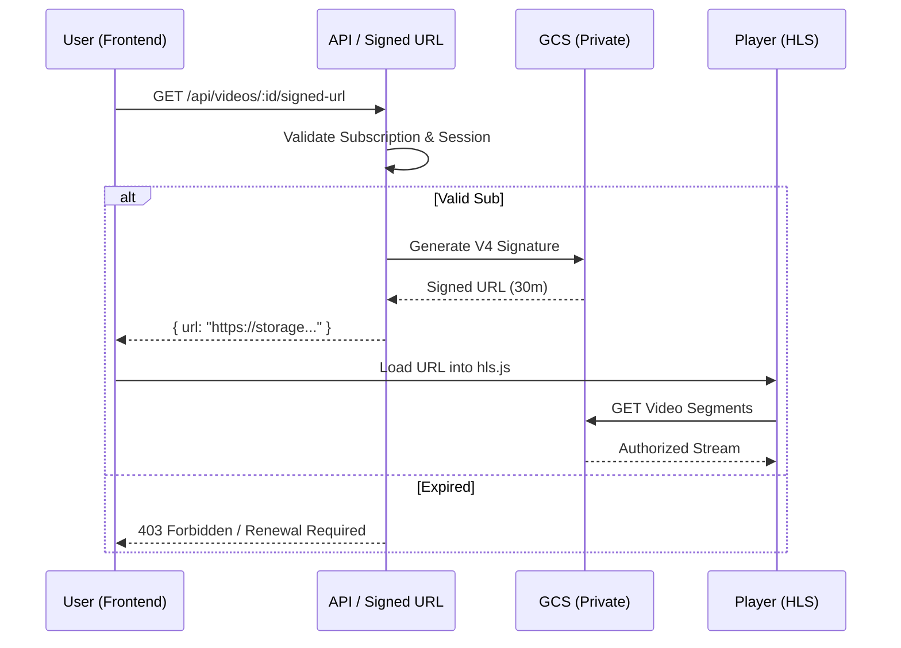

# Platform User Panel Mastery

This skill defines the architectural standards and implementation workflows for the **Baxtli Men** User Panel (TMA - Therapeutic Mobile Application). It ensures a premium, secure, and personalized experience for yoga therapy students.

## 1. Authentication & Session
- **Methods**: Support both `user_id` (internal/TMA) and JWT-based authentication.
- **Workflow**:
  1. Validate credentials.
  2. Check `subscription_status` (Prisma).
  3. Initialize session tracking (EventLog: `session_start`).
  4. Redirect to Dashboard if authorized.

## 2. Secure Video Streaming Flow


## 3. Dashboard Architecture
The dashboard follows a high-end SaaS aesthetic (Glassmorphism, #114539 primary color, #f6f9fe background).
- **KPIs**: Subscription expiry countdown, Days remaining, Total watch time, Completion %.
- **Retention**: If `expiry <= 3 days`, display a premium warning banner.
- **Sections**:
  - `Continue Watching`: Pull from `VideoProgress` where `completed = false`.
  - `Favorites`: Filtered by `Like` table.
  - `Recommended`: Personalized top 5 via AI Recommendation logic.
  - `Recently Added`: Last 5 `Lesson` entries with `AssetType.VIDEO`.
  - `Activity Heatmap`: Visualized from `EventLog` and `VideoProgress` timestamps.

## 3. Advanced Course Browsing
- **Filtering**: Implement server-side filtering by:
  - `Yoga Type`: Energy, Hormonal, Stretching, Therapy.
  - `Level`: Beginner, Intermediate, Advanced.
  - `Metadata`: Admin-defined tags (JSON column in `Course`).
- **Access Control**: 
  - `No Subscription` = Only `Lesson.isFree` and `Course.coverImage`.
  - `Active Subscription` = Full access to `Lesson.videoUrl` via Signed URL endpoint.

## 4. Secure Video Pipeline (HLS)
- **Engine**: Use HLS (hls.js) for adaptive bitrate streaming.
- **Security**: 
  - **Signed URLs**: v4 standard, 30-minute expiry.
  - **Private Storage**: Never expose `GCS_BUCKET_NAME` publicly.
  - **Rotation**: Generate URLs server-side through `/api/videos/[id]/signed-url`.
- **Controls**: Speed (0.5x-2.0x), Multitrack audio (Voice vs. Music tracks), Resume from `EnhancedVideoProgress.progress`.

## 5. Dynamic Watermark & Anti-Piracy
Implement `DynamicWatermark` component to protect intellectual property.
- **Dynamic Content**: Render `user_id`, `phone`, `date`, and `current_time`.
- **Movement Logic**:
  - `Interval`: Every 10 seconds.
  - `Positioning`: Random screen coordinates (X/Y).
  - `Opacity`: 0.2 – 0.35 (semi-transparent).
  - `Z-Index`: Always on top of video.
- **Anti-Bot**: 
  - Disable Right-Click, `download` attributes, and PiP.
  - Detect DevTools activity.
  - Max 2 simultaneous sessions per user.

## 6. AI Recommendation Engine
- **Logic**: Hybrid Recommendation (Behavioral + Content).
- **Signals**: Watch time, search query weight, tag preference, drop-off points (VideoProgress).
- **Triggers**: 
  - If user drops early: Suggest "Easier Sessions".
  - If inactive: Trigger re-engagement event.

## 7. Subscription & Retention
- **Check**: Before every signed URL generation, verify `subscription_status = ACTIVE` and `endsAt > now()`.
- **Reminders**: Automated events at T-3, T-2, T-1 days before expiry.
- **Renewal**: Redirect to PayMe on expiry; successful payment triggers `createOrExtendSubscription`.

## 8. Environmental Security (ENV)
Ensure these are ONLY accessible server-side:
- `GCS_PROJECT_ID`, `GCS_CLIENT_EMAIL`, `GCS_PRIVATE_KEY`
- `JWT_SECRET`
- `DATABASE_URL`

## 9. Folder Structure (Standard)
```text
src/
├── app/
│   ├── [lang]/tma/           # User Panel Root
│   │   ├── dashboard/        # Main Hub
│   │   ├── courses/          # Browser
│   │   └── video/[id]/       # Player
│   └── api/
│       ├── auth/             # Login/Session
│       ├── videos/           # Signed URLs
│       └── recommendations/  # AI Logic
├── components/
│   ├── tma/                  # Dashboard Components
│   └── video/
│       ├── Player.tsx        # HLS + Sync Audio
│       └── Watermark.tsx     # Security Layer
└── lib/
    ├── gcs/                  # Storage Utilities
    └── analytics/            # Retention Scoring
```

## 10. API Specification (Examples)

### GET `/api/dashboard`
```json
{
  "user": {
    "name": "Alex",
    "subscription": {
        "status": "ACTIVE",
        "daysRemaining": 12,
        "endsAt": "2026-02-25T00:00:00Z"
    },
    "stats": {
        "videosWatched": 42,
        "completionRate": 85,
        "retentionScore": 92
    }
  },
  "continueWatching": [...],
  "recommendations": [...]
}
```

### GET `/api/videos/:id/signed-url`
```json
{
  "success": true,
  "url": "https://storage.googleapis.com/antigravity-videos-yoga/yoga-session-1.m3u8?GoogleAccessId=...&Expires=...&Signature=...",
  "watermarkData": {
    "userId": "usr_12345",
    "phone": "+998901234567"
  }
}
```
