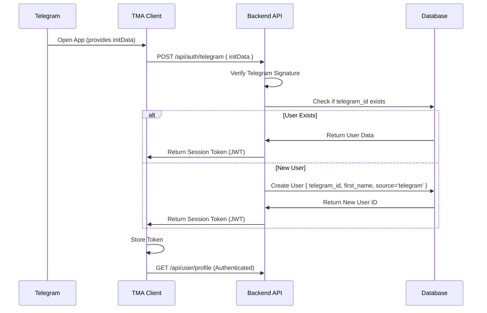

# Telegram Authentication & User Sync

## 1. Authentication Flow

The Telegram Mini App (TMA) uses a silent authentication flow that converts Telegram's `initData` into a secure session for the main application.



## 2. API Implementation

### POST `/api/auth/telegram`

**Request:**
```json
{
  "initData": "query_id=...&user=...&hash=..."
}
```

**Logic:**
1.  Parse `initData` query string.
2.  Sort keys alphabetically.
3.  Compute HMAC-SHA256 signature using `BOT_TOKEN`.
4.  Compare with provided `hash`.
5.  If valid, extract user data.

**User Creation Rules:**
- **UUID**: Auto-generate.
- **Username**: Use `telegram_username` if available.
- **Name**: content of `first_name` + `last_name`.
- **Photo**: Download `photo_url` and upload to GCS (optional, or store URL).
- **Source**: Set to `telegram`.

## 3. Session Synchronization

- The JWT issued to the Telegram Mini App must have the **same permissions** as the Web App session.
- If the user opens the Web App on a desktop and logs in via Telegram Widget, they should access the **same account**.
- **Phone Number Sync**: If the user provides a phone number in TMA (via `request_contact` button), update the existing user record, do NOT create a new one.

## 4. Auto-Login Experience

- **Goal**: Zero clicks to enter.
- The Middleware should check for `initData` on every TMA load.
- If the token is expired, silently refresh it using `initData` (which is valid for a limited time, but can be re-retrieved from Telegram client).
