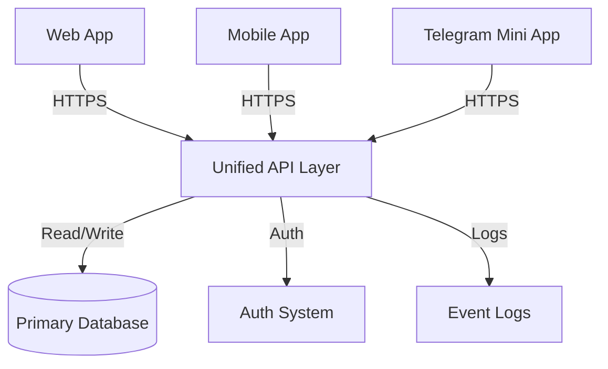

# Unified Logic & Architecture

## 1. Core Architecture

The system operates on a **Single Backend Principle**. There is no separate "Telegram Bot Backend" or "Mobile App API".



## 2. Platform Agnosticism

- **Frontend Role**: The frontend (Web/App/TMA) is strictly a **presentation layer**. It displays data and captures user intent.
- **Backend Role**: The backend executes all business logic. It does not know or care which platform initiated the request, other than for logging purposes.

## 3. Data Fetching Strategy

All platforms must use the exact same data fetching logic.

| Action | API Endpoint | Method |
| :--- | :--- | :--- |
| **Get Courses** | `/api/courses` | `GET` |
| **Get Profile** | `/api/user/profile` | `GET` |
| **Subscribe** | `/api/subscription/activate` | `POST` |
| **Watch Video** | `/api/videos/:id/signed-url` | `GET` |

## 4. User Identification

Users are identified by a unqiue `UUID` in the database.
- **Web**: Identified via Session Cookie / JWT.
- **Mobile**: Identified via JWT in Header.
- **Telegram**: Identified via JWT (issued after swapping `initData`).

## 5. Content Delivery

Content is centrally managed in the Admin Panel.
- **No manual text updates** in Telegram Bot code.
- **No hardcoded course lists** in Mobile App.
- All strings, prices, and media are fetched dynamically from the database.

## 6. Error Handling

Errors must be returned in a standardized JSON format for all platforms to display consistently.

```json
{
  "success": false,
  "error": "SubscriptionExpired",
  "message": "Your subscription has ended. Please renew to continue.",
  "action": "RedirectToPayment"
}
```
